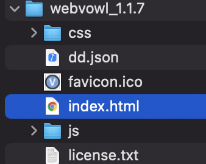
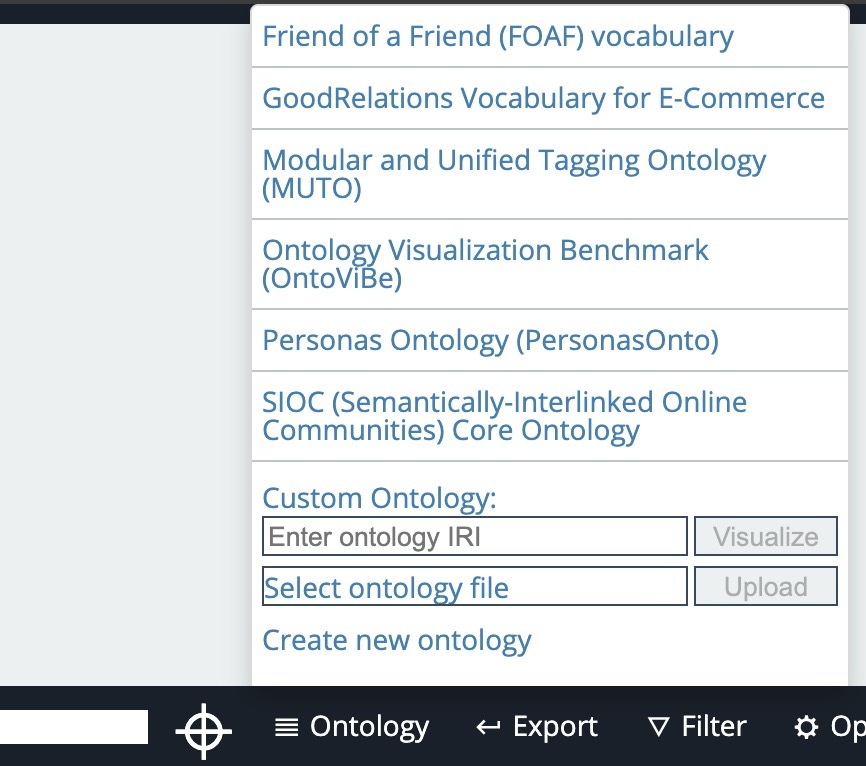

# webvowl1.1.7SE
## Intro
This tool is based on webvowl 1.1.7.
1. Intro to original tool http://vowl.visualdataweb.org/webvowl.html
2. Original tool online http://www.visualdataweb.de/webvowl/
3. Original tool download http://downloads.visualdataweb.de/webvowl_1.1.7.zip
## What does it do
1. Take json files as input. If input file needs conversion, use the python script.
2. Output a graph with colored(if preset in input file) nodes.
## How to use
1. Open the index.html file with your browser
  
2. Ontology -> Seletect ontology file -> choose your file
  
3. If a static graph is required, press "Pause".
# Comments
## Changes and options
### webvowl.js 
1. Funtion #8 line 360 from """var bgColor = that.backgroundColor()""" to """var bgColor = that.attributes()[0]"""
2. Function #28 line 2293 from """var bgColor = that.backgroundColor()""" to """var bgColor = that.attributes()[0]"""
3. Due to unknown bugs, the js script cannot read "backgroundColor" from input file. We use "attributes" to pass color to the draw method. 
### index.html
Manage unused functions and attributes on the webpage.
- Delete line 32-34; 418-441; 446; 449; 456
- Delete class specification on line 444
- Change """Comment""" to """Details"""; """Name""" to """Content"""; """Domain""" to """From"""; """Range""" to """To"""
### webvowl.ss
line 8 for font size
line 33 for default node color

# Python script
## To use
1. put the csv/txt file and scripts in the same directory
2. change the input file name in the script to the name of input

